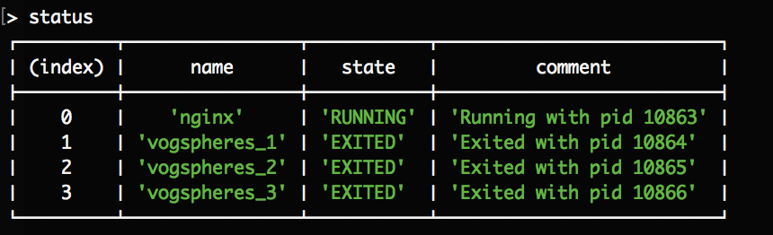

# Taskmaster

https://github.com/hugohow/42-work

Node.js process manager :bookmark:

not finished

## Example

config.yml : 

```
---
nginx:
  cmd: "node /Users/hugohow-choong/42/taskmaster/timer.js"
  numprocs: 1
  umask: '022'
  workingdir: "/Users/"
  autostart: true
  autorestart: true
  exitcodes:
  - 0
  - 2
  startretries: 3
  starttime: 1
  stopsignal: SIGTERM
  stoptime: 10
  stdout: "/Users/hugohow-choong/42/taskmaster/logs/nginx.stdout"
  stderr: "/Users/hugohow-choong/42/taskmaster/logs/nginx.stderr"
  env:
    STARTED_BY: taskmaster
    ANSWER: 42
vogsphere:
  cmd: "sleep 10"
  numprocs: 3
  umask: '077'
  workingdir: "/Users/hugohow-choong/42/taskmaster"
  autostart: true
  autorestart: unexpected
  exitcodes: 0
  startretries: 10
  starttime: 10
  stopsignal: USR1
  stoptime: 10
  stdout: "/Users/hugohow-choong/42/taskmaster/logs/vgsworker.stdout"
  stderr: "/Users/hugohow-choong/42/taskmaster/logs/vgsworker.stderr"
```


Launch the job control daemon :

```
npm run server
```

Launch the shell to interact with :

```
npm run app
```

## Commands for the client

```
status
```
Get all process status info.



```
shutdown
```
Stop all processes

### TODO
```
update
shutdown
reload
restart
start
```

Add tests
